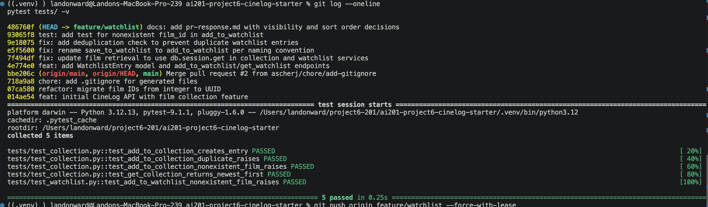

# PR Response Doc — CineLog Watchlist Feature

## AI Usage
<!-- Fill in at the end — how you used AI tools during this project -->
I used AI to help with setup and with commands to troubleshoot. I also used it to fix an issue with rebasing. I also summarized
the files because I wasn't sure on them at first. I used AI to breakdown the git mechanics. I used it to fix a large issue with
WatchlistEntry that appeared through a rebase.

## Comment 1 — Rename
**What I did:**
Renamed save_to_watchlist() to add_to_watchlist() in services/watchlist_service.py.
Searched the whole project for any remaining references with
`grep -rn "save_to_watchlist" .` to confirm no call sites were missed.
**How I verified:**
The grep search returned no results, confirming the old name is fully
replaced. Also ran pytest tests/ -v to confirm nothing broke.

## Comment 2 — Deduplication
**What I did:**
Added a duplicate check in add_to_watchlist() before creating a new
WatchlistEntry. It queries for an existing entry matching the same
user_id and film_id, and if one exists, raises a new AlreadyInWatchlistError
instead of silently creating a duplicate row. This follows the same pattern
as add_to_collection()'s duplicate check in collection_service.py, just
swapped to the WatchlistEntry model and a watchlist-specific error class.
 


**How I verified:**
Ran the full test suite (pytest tests/ -v) to confirm the change didn't
break existing tests.


## Comment 3 — Missing test
**What I did:**
Created tests/test_watchlist.py and wrote test_add_to_watchlist_nonexistent_film_raises,
modeled directly on test_add_to_collection_nonexistent_film_raises from
test_collection.py — same fixture structure (app, sample_user) and same
assertion pattern (pytest.raises around a call with a nonexistent film_id).

**How I verified:**
Ran pytest tests/test_watchlist.py -v — test passed. Also confirmed that
FilmNotFoundError imports cleanly from services.watchlist_service (it's
re-exported from collection_service via the existing import in
watchlist_service.py).


## Comment 4 — Default visibility
**My position:**
I would argue to leave it as public=True. 
**Reasoning:**
This is optimized for 
discover and community. This would allow for social opportunities that would be better most of the time than worse. I could see this being a privacy concern, but I don't think it reveals enough to warrant the shut down of the social opportunities for people to stumble across your watchlist. I'm pitching this closer to Letterboxd since it specifically says community it its branding.

**Tradeoff acknowledged:**
Privacy. Maybe you add something to your watchlist so you don't forget, but its personal or revealing in some way.

## Comment 5 — Sort order
**My position:**
I would say sort order should be newest first

**Reasoning:**
 since I think it's most relevant to show new releases or recent watches, in terms of social opportunities and trends.
 
**Engagement with reviewer's point:**
That's especially true for a watchlist, since it's forward-looking. People add something after seeing something that spikes their interest and it remains fresh.

## Comment 6 — Rebase
**What conflicted:**
Running `git rebase origin/main` produced a textual conflict in `.gitignore`,
non-conflict: main's UUID refactor replaced `models.py` entirely. The `WatchlistEntry` class was never part of main's history so git merged the files without flagging a conflict.  

**How I resolved it:**
Merged the `.gitignore` lines manually, keeping the union of both versions. I Re-added the class using the post-refactor UUID
(`db.String(36)`) instead.

**How I verified no conflict remains:**
Ran `pytest tests/ -v` and all 5 tests passed. Ran `git log --oneline --graph` to confirm no conflicts


## PR Description
<!-- Written at the end — feature overview, design decisions, manual testing steps -->



### What this feature does
Adds a watchlist feature to CineLog, letting users save films they want
to watch later. Includes a new `WatchlistEntry` model UUID-based and a `get_watchlist()` function that returns a user's saved films.

### Design decisions
**Default visibility:** Watchlists default to `public=True`, optimizing
for discovery and social engagement. This trades off some privacy, since a watchlist can reveal personal taste or
interests, but the exposure is limited enough that the social upside outweighs it.

**Sort order:** Watchlists are sorted by date added, newest first. This surfaces what a user most recently found
interesting, matching the forward-looking nature of a watchlist.

### How to manually test
**Setup**
1. Start the app: `python app.py`
2. Create a test user and a test film via Python shell, seed script

**Test 1: Add a film to the watchlist**
```bash
curl -X POST http://127.0.0.1:5000/watchlist/<user_id>/add \
  -H "Content-Type: application/json" \
  -d '{"film_id": "<film_id>"}'
# Expected: 201 response with the new watchlist entry as JSON
```

**Test 2: View the watchlist**
```bash
curl http://127.0.0.1:5000/watchlist/<user_id>
# Expected: JSON list containing the film added above, sorted newest-added first
```

**Test 3: Try adding the same film twice**
```bash
curl -X POST http://127.0.0.1:5000/watchlist/<user_id>/add \
  -H "Content-Type: application/json" \
  -d '{"film_id": "<film_id>"}'
# Expected: AlreadyInWatchlistError isn't caught at the route level yet,
```

**Test 4: Try adding a film that doesn't exist**
```bash
curl -X POST http://127.0.0.1:5000/watchlist/<user_id>/add \
  -H "Content-Type: application/json" \
  -d '{"film_id": "00000000-0000-0000-0000-000000000000"}'
# Expected: same situation as Test 3 where FilmNotFoundError isn't caught at the route level
```

**Test 5: Run the automated suite**
```bash
pytest tests/ -v
# Expected: all 5 tests pass
```
